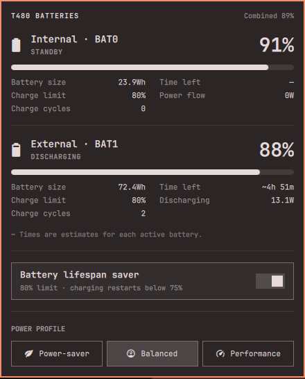

# T480 Batteries

An Omarchy power-panel clone for the ThinkPad T480's two batteries:
**Internal (BAT0)** and **External (BAT1)**. Built from the Omarchy 4.0.2
`omarchy.power` panel, with its theme, progress bars, keyboard navigation,
power-profile buttons, and right-click percentage toggle.

Each battery reports its own percentage, charge/discharge/standby state,
full capacity in Wh, cycle count, time remaining or time to full, instantaneous
power in W, and charge limit when holding. A missing external battery is
explicitly shown as not detected and is rediscovered on refresh.

The bar icon and header use **combined charge weighted by full energy capacity**.
They never average the two percentages: a 24 Wh pack and a 72 Wh pack contribute
different amounts of usable energy. Both pack percentages appear in the popup.



## Install locally

Requirements: Omarchy 4.0.2's Quickshell plugin API, Python 3, and an active
Omarchy desktop session. Monitoring needs no additional Python packages or root access.
The optional lifespan saver requires installing the privileged helper below.

```sh
cd ~/code/t480batteries
python3 install.py
```

The installer backs up `shell.json`, links this checkout at
`~/.config/omarchy/plugins/io.github.ijonas.t480batteries`, and replaces the stock
Power widget using Omarchy's `clonedFrom` mechanism. It leaves the stock
`omarchy.battery` low-charge warning/power-profile service enabled.
It can be rerun safely. Edit this project directly; Omarchy hot-reloads the
plugin. The packaged Omarchy source is never changed.

Click the bar's battery icon, or run:

```sh
omarchy-shell omarchy.power open
```

Right-click toggles combined percentage on horizontal bars, just like stock
Omarchy. Up/down selects the saver or profile row; left/right selects a profile.
Enter activates the selected control, Escape closes,
and Tab moves between panels. Scroll the panel if screen space is limited.

## Battery lifespan saver

Install charge control once (a graphical administrator prompt appears):

```sh
pkexec ./install-saver.sh
```

Open the battery panel and toggle **Battery lifespan saver**:

- On: both batteries stop charging at **80%**, restarting below **75%**.
- Off: restores the factory **0% start / 100% stop** thresholds.
- Existing charge above 80% is retained; enabling never forces discharge.
- Each card shows its actual hardware charge limit. Authentication cancellation
  or an error leaves the toggle reflecting hardware, not the requested value.
- An absent external pack receives the saved mode when reinserted. A systemd
  timer checks every 30 seconds (10 seconds after boot), also covering resume.
  Unchanged limits are not rewritten. No continuously running daemon is added.
- The saved mode owns these thresholds; do not also configure TLP or another
  threshold manager. Firmware may delay starting a charge near full capacity.

Runtime writes go through a root-owned, isolated Python helper at
`/usr/local/libexec/t480batteries/charge_limit.py`, restricted to `enable`,
`disable`, and `restore`. Polkit requires administrator authentication and may
cache it briefly for the active session. Present batteries are validated before
writes, read back afterward, and rolled back on failure. Settings are stored in
`/var/lib/t480batteries/mode.json`. Installation alone preserves existing limits;
no saved preset means the timer does nothing. Re-run the installer after editing
helper/system files; editing the checkout cannot change privileged runtime code.

To remove charge control and restore 100%, run these in a terminal:

```sh
sudo systemctl disable --now t480batteries-charge-limit.timer
sudo systemctl stop t480batteries-charge-limit.service
sudo /usr/local/libexec/t480batteries/charge_limit.py disable
sudo rm -f /etc/systemd/system/t480batteries-charge-limit.{service,timer}
sudo rm -f /usr/share/polkit-1/actions/io.github.ijonas.t480batteries.policy
sudo rm -f /usr/local/libexec/t480batteries/charge_limit.py
sudo rm -f /var/lib/t480batteries/{mode.json,control.lock,mode.tmp}
sudo systemctl daemon-reload
```

Reinsert an absent battery before removal to restore its limit too. Removing the
panel alone does **not** remove the charge-control timer or saved preference.
Installer upgrade backups are under `/var/backups/t480batteries/`.

Thresholds use the kernel's [ThinkPad battery charge control](https://www.kernel.org/doc/html/latest/admin-guide/laptops/thinkpad-acpi.html).

## Data and limitations

- BAT0/BAT1 map to the T480's internal/removable battery. This is not a generic
  detector of the physical placement of batteries on other laptop models.
- Reads each battery's own `/sys/class/power_supply/BAT{0,1}` attributes.
  No serial numbers, account data, or identifiers beyond BAT0/BAT1 are collected.
- Refreshes every 5 seconds while open, every 30 seconds while closed, immediately
  on opening and on UPower AC/battery changes. Battery insertion/removal appears
  by the next refresh. This is polling, not an instantaneous hot-plug guarantee.
- Missing/bad telemetry is unknown (`—`), not zero. Zero cycles and 0 W are valid.
  Failed snapshots clear stale charge values and display an error with automatic retry.
- Hardware-reported time is preferred. Otherwise estimates use that battery's
  remaining energy / instantaneous power, marked **~**. Charging estimates assume
  today's rate continues to the configured charge limit (or full). Tapering may
  lengthen actual time; capped charging uses an energy estimate instead of native full-time. No estimate is shown for a waiting battery or near-zero flow.
  Per-pack times are **not total laptop runtime**, since the T480 switches packs.
- Energy is preferred over charge. Drivers exposing only charge use nominal
  voltage (or current voltage when nominal is absent) to estimate Wh. Rates prefer
  `power_now`, falling back to current × voltage. Sysfs reads are not atomic across
  files; transient plug/unplug readings settle at the next refresh.
- The read-only collector never writes battery settings. The separate authenticated
  helper changes only charge thresholds; it never calibrates or forces discharge.

Sysfs units follow the [Linux power supply documentation](https://www.kernel.org/doc/html/latest/power/power_supply_class.html).

## Validate

```sh
python3 -m unittest discover -s tests -v
node --test tests/model.test.cjs
omarchy plugin validate .
python3 batteries.py
```

Node is a test dependency only. The Python tests use synthetic sysfs fixtures:
unequal pack sizes, independently changing percentages, cycles/thresholds, removal/reinsertion, idle vs
charging, invalid telemetry, and current/charge fallbacks. They do not modify
real batteries or switch power profiles. `batteries.py --root /path/to/fixtures`
is also available for offline diagnosis.

## Fleet and recovery

On `tank`, a local host-only override in
`~/omarchy-fleet/hosts/tank/config/.config/omarchy/shell.json` selects this widget.
It preserves the ProtonVPN role's layout and changes only the power widget id.
The plugin itself is installed from this local project; Fleet cannot fetch it
on a new host until a remote repository is published and declared. Future shared
bar changes should also be reviewed against this full-file host override.

```sh
python3 install.py --uninstall
```

This restores the stock Power widget and removes only the development symlink,
keeping the project. If using the tank Fleet override, change its widget id back
to `omarchy.power` (or remove the override after reviewing other host edits).
Shell backups are in `~/.local/state/t480batteries/`. Restore a whole backup
only if you intend to undo all shell changes made since that snapshot.

## Attribution

T480 Batteries contributions copyright (c) 2026 Stacking Turtles Ltd.

`Panel.qml`, `BatteryCard.qml`, and `Model.js` adapt Omarchy's Power panel and
its MIT-licensed visuals/profile handling. Battery telemetry and two-pack layout
are implemented here. See `LICENSE`. No low-battery notification service is forked.
